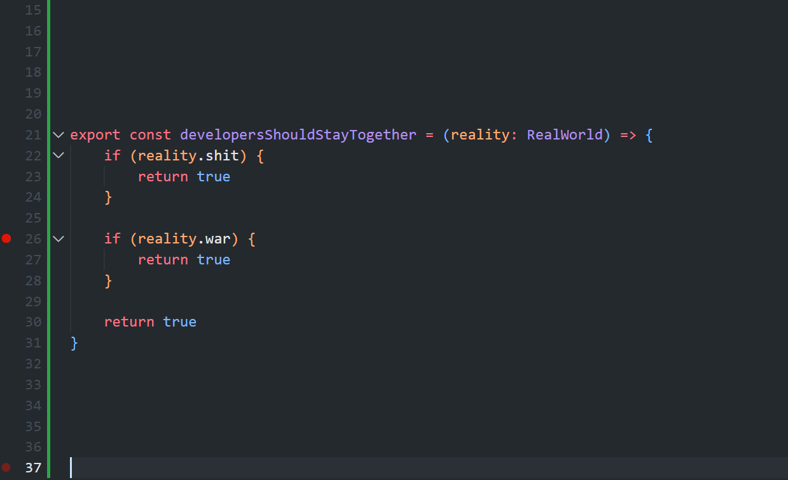

# Ультимативная взаимопомощь — единственный шанс русскоязычных айтишников жить как раньше

Три года назад я приходил к IT сообществу — тогда я делал это через Хабр — и писал: "Мы должны стоять друг за друга горой. Разработчики это сила, с которой бизнес и государство не могут не считаться, мы должны защищать себя и свои права вместе — потому что можем." Меня и тогда никто особо не слушал — ну зачем, у разрабов и так все хорошо, нам хорошо платят, нас любят, о нас заботятся. Не за что нам бороться, всё есть. Это и тогда было не так: айтишником несправедливо увольняли, кидали на деньги, унижали на собесах и на работе — просто не так сильно и часто, как всех остальных. Сейчас всё круто поменялось, сейчас, когда началась война, крепко ударившая по российскому IT и ещё крепче — по несчастным людям с СНГшным паспоротом, рынок кандидата медленно поплыл в сторону рынка работодателя. Ну, для нас. 

Работодатели этим уже пользуются, будут ещё больше. 
Они давно ждали возможности спустить "зажравшихся" разрабов с небес на землю. 
Ситуация усугублятется тем, что это не единственная наша проблема сейчас — кроме работодателей,
у нас есть ещё вредящее нам государство, и государства. 
 
Запад отменяет русскоязычных, РФ мешает нам уезжать или получать свою валюту, карты не работают, наши подушки растрачиваются на релокейты, с которыми приходится справляться в условиях полной растерянности и горящей под ногами земли.

В общем-то, наше положение просто описать: Мы нахер в полном дерьме.

Дерьмо, в котором мы оказались, это ещё не финальное, итоговое дерьмо. Это только ещё маленькое дерьмишко, которое только вылупилось из яйца, и начинает потихоньку оперяться.

Земля под нашими ногами горит сейчас, но будет гореть ещё сильнее. Нас и так уже не пинает только ленивый, будет ещё хуже.

Устроился на работу, всё нормализовалось, бам! Партнер твоего работодателя больше не хочет работать с теми, у кого есть русский пасспорт. Или беларусский. Или украинский. Ну, от греха.

Всё, ты вышвырнут, в чужой стране, со сгорающей рабочей визой, без денег. 

Это если ты ещё смог устроиться. Если релокнулся, а работа осталась российской — пиши пропало. Ты сверхуязвим, каждый новый подзаконный акт, каждое решение цб, каждое заявление бинанса будут уменьшать твои шансы выжить.

Торг за зп сейчас вести особенно приятно — ребята, что тебя нанимают, прекрасно знают, в каком ты положении. Они используют это против тебя, а в замен, продадут тебе иллюзию стабильности — в которую сами не верят.

Наша страна параллельно не преминет заморозить тебе бабки, закрыть въезд обратно, или не выпустить тебя отсюда — всё чтобы вставить палки в колёса.

В общем, стабильность и процветание, особенно гарантированные, обрести сейчас сложно.

Но. Но. В мире всё ещё ситуация — разработчики всем нужны как воздух. Много разработчиков, очень много. За любые бабки. 

Для нас это выглядит парадоксально — тут ты из-за своего паспорта нахер не нужен, а вот тут тебе готовы стелить ковровые дорожки, отсыпать жирный велком бонус, и предлагать оффер с гигантской суммой. 

Как повезёт. Причём, рынок трясет — назавтра эти компании меняются местами. У половины из нас ситуативно всё очень хорошо, у другой половины всё очень плохо. И они постоянно меняются местами.

Поймите меня правильно, я не говорю, что если у тебя всё в порядке, зачит это скоро кончится. У меня самого стабильная валютная работа. Но нынешняя стабильность хрупка, как весенний лёд. Она может потрескаться и сплыть за считанные часы. А может и нет.

Я сижу и думаю, как мне обезопасить себя, свою семью и друзей от ситуации, когда с утра ты открываешь слэк, и читаешь, что ты уволен. И не просто уволен. Ты охереть как уволен. Ты уволен к чертям собачьим, за то что у тебя неправильный паспорт. Без компенсаций и права на помилование, без оглядки на качество твоей работы, на твой вклад в проект, на твои отношения с коллегами. Просто вот так, тебя взяло и переехало жизнью.

Как сумасшедший, с первого дня войны я начал откладывать бабки. В валюте, наличманом. Я написал всем разрабом, кого знаю, и заверил, что если у них начнуться большие проблемы, я помогу чем смогу. Сам при этом держал в голове: если проблемы начнуться уже у меня, я приду к ним за помощью.

Потому что те из нас, у кого всё хорошо, действительно могут помочь тем, у кого всё плохо, и это имеет огромный смысл, ведь сейчас мы постоянно меняемся местами.

В том или ином смысле, у всех у нас отняли наш дом, нашу стабильность, нашу жизнь. Всё что у нас осталось, это скилл, который +- способен нас прокормить где угодно, и сообщество таких же как мы.

Это сообщество — наш спасательный круг. Наша единственная гарантия. Ситуация, когда сто тысяч твоих единомышленников и коллег, у которых много денег, возможностей, знакомств, и рычагов готова вытащить тебя, если ты вдруг угодил в кучу говна — вот что сейчас нужно.

Разработчики, и айтишники вообще, как никто умеют объединяться, координироваться и договариваться между собой для достижения общих целей. 

### Так вот я говорю вам: самая большая общая цель сейчас — вернуть для нас всё как было

**Свободу, комфорт, стабильность, положение на рынке, возможности, безопасность, и возможность делать важные вещи.**

У нас всё для этого есть. 
Вот что можно сделать конкретно: 
- предлагайте помощь другим и просите помощь в минорных штуках, вроде обмена долларов на битки, приёма русскоязычных айтишников в странах, в которых вам удалось осесть, советами и рекомендациями.
- помогайте русскоязычным искать работу, давайте рефы в свои компании, спрашивайте у работающих друзей, не нужны ли им такие специалисты, продавливайте у себя расширение штата, советуйте нанимать русскоязычных. Пишите гайды, как вам удалось устроиться на хорошую работу. Если в ваших силах влиять на найм и неувольнение своих — используйте это.
Помогайте с тестовыми, подготовьте к собесу, подбодрите неуверенных в себе.
- пропогандируйте то, что пропогандирую я. Критикуйте компании, которые позволяют себе дискриминацию к людям из СНГ. Не повзоляйте никому и нигде безнаказно защищать идею не работать с нами. 
- помогайте менторством, директивно, и делегируя, заботьтесь о тех, кому нужно вырастить скилл
- просите помощи сами. Нам нужно взрастить высочайшую культуру взаимопомощи. Ультимативной взаимопомощи.
- занимайте деньги. В нашей культуре на это стоит мощный блок, но часто, это самая нужная помощь. Тупо занять денег человеку из сообщества. Если он разработчик, он сможет их вернуть. А тех, кто помощь у сообщества принял, но ответным добром платить отказался — мы задиприкейтим, и восстановим справедливость. Силами сообщества.
- все кейсы, где кто-то кому-то помог встать на ноги, нужно подсвечивать, орать на них о каждом углу. Показывать, что это работает. 

Всё это может прозвучать довольно возмутительно, типа, а чего это я тут должен ради других усираться? Ты и не должен. Но сделай это, и когда проблемы начнуться у тебя, мы придём, и вытащим тебя из любого дерьма. 
Тех, кто помогает людям из сообщества, мы будем чествовать, писать о них тексты на главной, помогать им во всех начинаниях, и страховать от любых ошибок. 

Ведь в этом вся и идея — страховка, гарантия. В целом, я вообще считаю, что всем стоит помогать всем, но доверие — штука тонкая. Айтишникам я поверить готов. Кто-то меня действительно обманет, но я верю: процент таких будет низок.

Я чувствую идею, чувствую её мощь и перспективу, но на конкретных деталях и предложинеях я могу плавать, но это нормально: мы же сообщество. Коллективный разум. Уверен, многие из вас могут предложить что-то ещё. Вам стоит это сделать.

Исторически, народы без страны, выживали за счёт ультимативной координации друг с другом. Мы не народ без страны. Мы — ставшие бездомными люди, объединенные одной профессией, общими проблемами, и языком общения. Если мы не будем помогать друг другу, нам никто не поможет. И нас просто сотрут.
