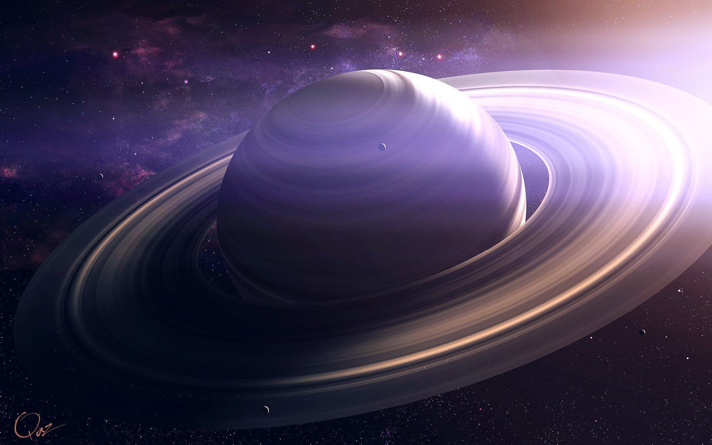

# Сколько лет существуют кольца у Сатурна?

Возраст Солнечной системы составляет около 4,57 млрд. лет – гигантское, не укладывающееся в голове количество времени. Но это вовсе не означает, что все планеты Солнечной системы сразу же после её формирования были такими же, какими видим их мы. Например, выяснилось, что одна из самых узнаваемых планет – Сатурн – долгое время и вовсе была без  своих «фирменных» колец.

По словам специалистов из исследовательского института SETI,  кольца вокруг шестой планеты от Солнца появились совсем недавно по космическим меркам — около 100 млн. лет назад.

Данное утверждение стало возможным после того, как специалисты завершили проект по исследованию возникновения и движения спутников Сатурна, которых на текущий момент насчитывается целых 62! Для того, чтобы спрогнозировать будущее поведение спутников Сатурна, необходимо было построить точную компьютерную модель их движения. Вращаясь вокруг планеты, спутники влияют на орбиты друг друга, и со временем это влияние становится всё более и более заметно. Анализируя орбиты небесных тел, ученые обнаружили слабые следы взаимодействия друг на друга лун Сатурна, что говорит об их малом возрасте — всего около 100 млн. лет назад. Это гораздо меньше, чем возраст самого Сатурна, который составляет 4.57 млрд. лет.

В момент формирования спутников планеты происходили их многочисленные столкновения в виду неустоявшихся орбит, из-за чего и возникли привычные нам кольца, состоящие из миллиардов частичек пыли и кристаллов льда.

