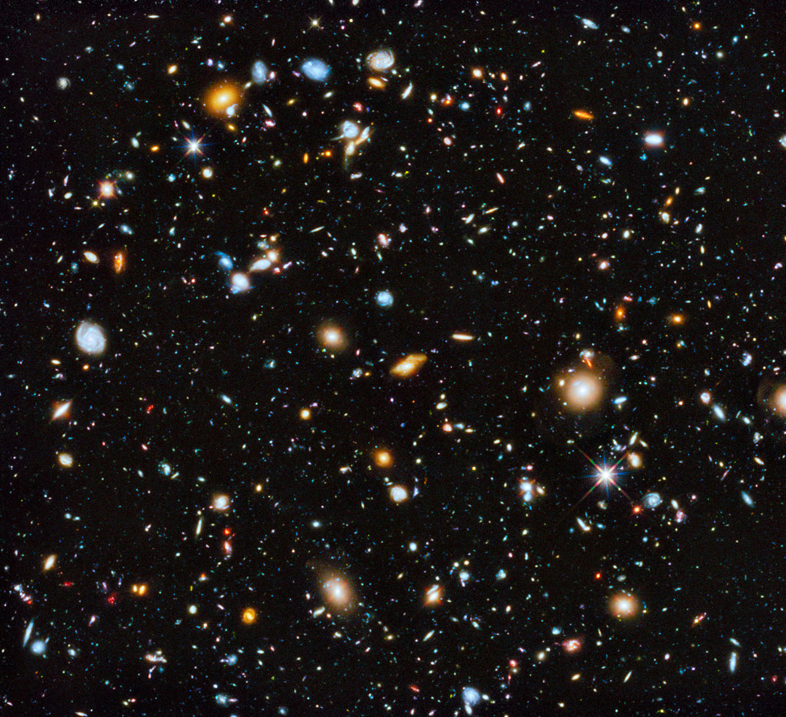

# Вселенная содержит в 10 раз больше галактик, чем мы думали

Вселенная не устает преподносить нам сюрпризы...

Человека всегда интересовал вопрос, насколько большой мир, где он живет. Первое реальное представление о величине Вселенной было получено в 1990 году, когда на низкую околоземную орбиту был запущен телескоп «Хаббл». За первые годы его работы были обнаружены миллионы галактик, а их общее число в видимой Вселенной, по подсчетам ученых, могло составлять от 100 до 200 миллиардов. И каждая из этих галактик содержит в себе миллиарды звезд. Уже тогда ученые были поражены истинными масштабами Вселенной. Но теперь пришло время удивляться еще больше: количество галактик в видимой Вселенной может составлять около 1 триллиона, что минимум в 10 раз превышает предыдущие расчёты.

Ученые из Ноттингемского Университета сделали открытие при помощи все того же телескопа Хаббл. Представив изображения, полученные телескопом, в 3D формате, ученые смогли изучить распределение галактик во Вселенной на протяжении миллиардов лет ее расширения. В результате они пришли к выводу, что, когда Вселенной был «всего» 1 млрд. лет с момента Большого взрыва, галактики распределялись в пространстве в 10 раз плотнее, чем сейчас. При расширении Вселенной некоторые галактики слились воедино и стали достаточно большими для того, чтобы быть обнаруженными современными техническими средствами. Другие же галактики все еще остаются в тени и, основываясь на математических моделях, которые описывают чувствительность имеющихся телескопов, таких «невидимых» галактик 90% от общего числа в видимой Вселенной.

Но уже в 2018 году, когда на орбиту будет выведен телескоп Джеймс Уэбб (James Webb space telescope), разрешающей способности которого, по расчетам ученых, будет достаточно, чтобы уловить свет самых далеких и тусклых галактик.

