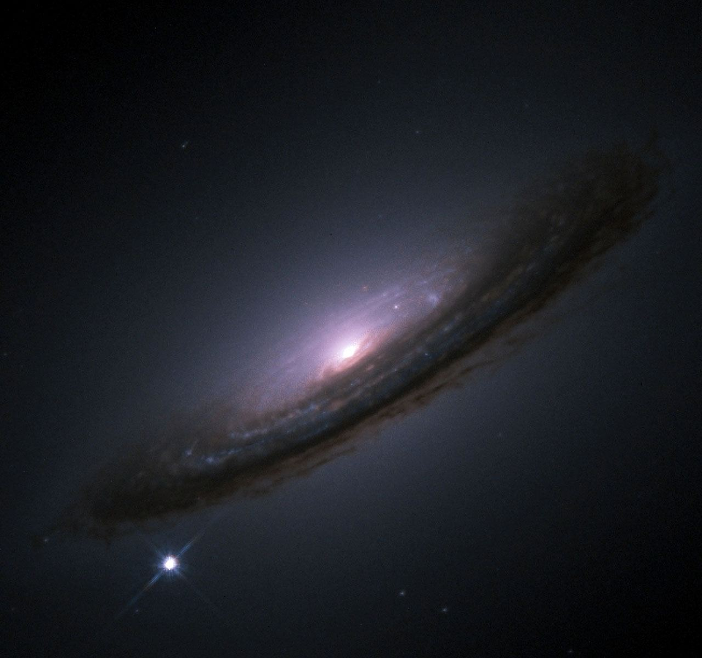

# Сверхновые типа 1а

Допустим, у вас есть двойная звездная система, что достаточно распространено. Предположим, что одна из звезд больше другой (это происходит постоянно) и проходит свой обычный звездный жизненный цикл быстрее. В конце концов она умирает, сбрасывая свои внешние слои и оставляя после себя белую карликовую звезду.

Через значительное количество времени, в конце концов, звезда-компаньон также заканчивает свой собственный жизненный цикл, набухая и превращаясь в красного гиганта. Иногда этот красный гигант становится настолько большим и подходит слишком близко к своему мертвому собрату, что газ из гиганта начинает перетекать на поверхность белого карлика.

Звезды - белые карлики - забавные штучки. Они удерживаются в равновесии экзотическими квантовыми силами, чем-то, что называется давлением вырождения. Это давление вырождения может удерживать звезду веками, но и у нее есть предел. Если звезда становится слишком тяжелой, давление вырождения может быть превышено, и звезда разрушится.

Когда звезды коллапсируют, она обычно взрывается. В случае сверхновой типа 1a весь углерод и кислород, из которых состоит белый карлик, оказываются намного ближе друг к другу, чем обычно, что вызывает вспышку слияния. Этот синтез высвобождает достаточно энергии, чтобы создать еще больше синтеза, и прежде чем вы это осознаете, весь белый карлик разлетается вдребезги.

Одним из замечательных побочных преимуществ этого процесса является то, что все сверхновые типа 1a во Вселенной практически одинаковы. С небольшими изменениями, каждый раз это одна и та же история создания и смерти. Это означает, что эти типы сверхновых каждый раз имеют примерно одинаковую яркость. Астрономы могут использовать этот факт для калибровки расстояний до своих галактик-хозяев, что позволит им проводить поистине огромные измерения расстояний.

