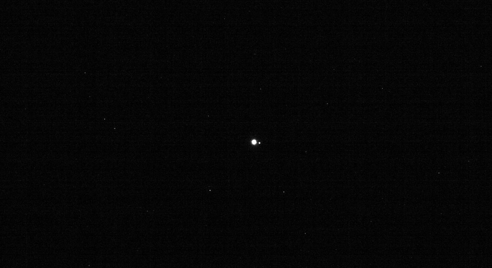

# Так выглядят Земля и Луна с расстояния 63,6 млн. километров

Уже с небольшого по космическим меркам расстояния в 63 миллиона километров наша Земля и ее естественный спутник выглядят как маленькие песчинки света. Только два этих небесных тела в безбрежном океане космоса смог пока что покорить человек, побывав на них самостоятельно.

Данная фотография была сделана межпланетной станцией OSIRIS-REx, запущенной NASA в еще в 2016 году. Задача OSIRIS-REx — долететь до астероида Бенну, взять с него пробы грунта, а затем доставить их на Землю. Окончание миссии планируется в 2023 году.

Когда межпланетная станция находилась на расстоянии 63,6 млн. км от Земли, летя со скоростью 8,5 км/сек, инженеры решили протестировать работоспособность бортовой камеры и радиопередатчиков, сфотографировав нашу планету и ее естественный спутник.