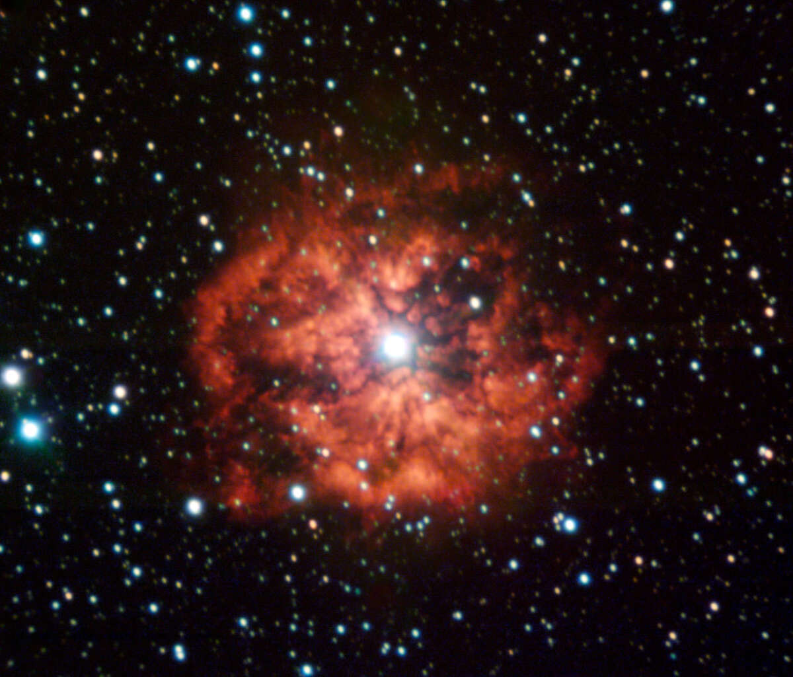

# Что такое звезда Вольфа-Райе

Когда гигантские звезды умирают, они взрываются мощными взрывами сверхновых. Но прежде чем сделать это, они проходят через очень странный, но короткий цикл в своей жизни.

Звезды Вольфа-Райе были открыты французскими астрономами Шарлем Вольфом и Жоржем Райе в Парижской обсерватории в 1867 году. Они обнаружили три звезды, которые имели необычно сильные линии излучения в спектрах, что означало, что элементы в этих звездах нагревались до чрезвычайно высоких температур.

Тайна того, что на самом деле представляли собой звезды Вольфа-Райе, сохранялась более века. Отчасти это связано с тем, насколько они редки. Даже сегодня астрономы знают только о 500 из них в Млечном Пути (по сравнению с сотнями миллиардов всех звезд в галактике).

Сегодня астрономы называют звездой Вольфа-Райе звезду, которая вот-вот умрет. Когда большие звезды - по крайней мере, в 8-10 раз превышающие массу Солнца - приближаются к концу своей жизни, они переходят от синтеза водорода к синтезу гелия в своих ядрах. Из-за их чрезвычайной массы синтез гелия высвобождает огромное количество энергии. Эта энергия заставляет внешние слои звезды набухать настолько, что они полностью отделяются от звезды, образуя вокруг звезды газовую оболочку, похожую на пузырь.

В конце концов эта оболочка расширится еще больше, создавая туманность. Действительно, многие звезды Вольфа-Райе окружены такими туманностями. Но в то же время оболочка улавливает много света, исходящего от звезды, который нагревает ее и заставляет оболочку светиться. Это источник странных линий излучения, замеченных Вольфом и Райе.