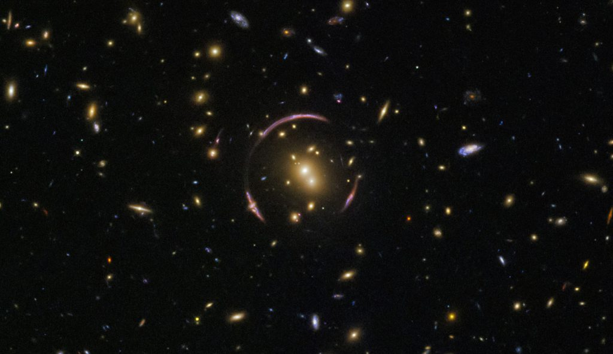

# Кольцо Эйнштейна — красивое следствие теории относительности

На самом деле на этом фото запечатлены сотни и даже тысячи галактик. Перед нами — редкое и впечатляющее явление, которое называют кольцом Эйнштейна. Оно возникает, когда гравитация массивного тела настолько искривляет вокруг себя пространство-время, что электромагнитное излучение отклоняется от прямых траекторий.

Массивный объект, который так сильно влияет на гравитацию, называется гравитационной линзой. На этом снимке, сделанном телескопом Хаббл, роль гравитационной линзы выполняет часть космического кластера SDSS J0146-0929, состоящего из большого скопления галактик. Их изображения можно увидеть по краям этой изящной и редкой гравитационной линзы.

