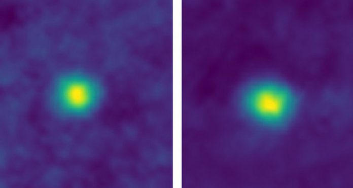

# Эта фотография сделана на рекордном от Земли расстоянии

Межпланетная станция «Новые горизонты» продолжает радовать астрономов уникальными фотографиями и ставить новые рекорды. Космический аппарат уже смог развить в окрестностях Земли самую высокую скорость среди искусственных аппаратов, а также передал самые детализированные фотографии Плутона на сегодняшний момент.

На этот раз станция «Новые горизонты» провела самую удаленную фотосессию в истории. В объектив установленной на борту камеры попали две карликовые планеты, находящиеся в поясе Койпера, которые можно увидеть на снимке выше. В момент фотографии расстояние между станцией и Землей составляло 6,06 млрд. километров.

Подобные фотографии станции необходимо делать время от времени для калибровки камеры. В настоящий момент «Новые горизонты» направляется к 2014 MU69 — транснептуновому астероиду в поясе Койпера. Каждый день межпланетная станция пролетает расстояние около 1,1 млн. километров. Ученые надеются получить первые снимки астероида уже летом 2018 года.

Интересно, что предыдущий рекорд по самой удаленной от Земли фотографии принадлежал знаменитому «Вояджеру-1», который прислал снимок крохотной голубой точки — нашей Земли.

