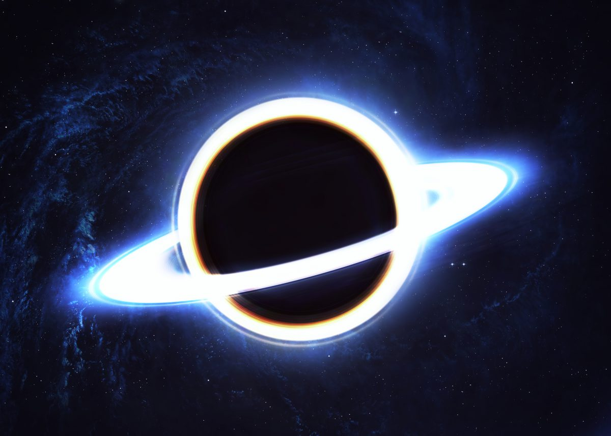

# Древнейшая сверхмассивная черная дыра удивила астрономов

Согласно современным представлениям, наша Вселенная образовалась в результате события, известного как Большой взрыв. Из точки с бесконечно высокой температурой и плотностью по неизвестным причинам произошло резкое расширение (взрыв), в результате чего возникло пространство, время и вообще наш мир. За считанные доли секунды молодая Вселенная переходила из одного физического состояния в другое, пока через 400 млн. лет в ней не начали образовываться первые звезды, галактики и другие космические объекты. Расширение пространства, продолжающееся и по сей день, разносило эти объекты все дальше от нас – на самый край видимой Вселенной, и сейчас наши телескопы пытаются улавливать их излучение, буквально заглядывая в прошлое и видя объекты такими, какими они были в начальный момент своего существования.

Недавно астрономы смогли зафиксировать свет от одного из самых удаленных от нас квазаров. Считается, что квазары – это ярчайшие объекты во Вселенной, представляющие собой активные ядра галактик. В их центре находится гигантская черная дыра, которая поглощает в себя окрестное вещество, создавая ярчайший аккреционный диск.

Его фотоны, зафиксированные орбитальными телескопами, по подсчетам ученых были выпущены квазаром примерно 13 млрд. лет назад – именно столько времени частицам потребовалось, чтобы достичь Земли. Расстояние же до квазара сейчас и вовсе составляет десятки миллиардов световых лет – за это время пространство успело увеличиться в разы.

 
Расчеты показали, что черная дыра данного квазара имеет массу около 800 млн. Солнц! Судя по всему, эта черная дыра образовалась не позднее, чем через 700 млн. лет после Большого взрыва. И здесь прослеживается явное противоречие с существующей теорией развития Вселенной. Предполагается, что первые звезды начали формироваться из газопылевых облаков под действием гравитационных сил в промежутке между 400 и 700 млн. лет после Большого взрыва. Ученые утверждают, что если обнаруженная черная дыра возникла на самом раннем из возможных этапов, то даже при постоянном «кормлении» ее звездами и другими материальными объектами она не смогла бы за несколько сотен миллионов лет набрать столь огромную массу.

Что же это означает? Возможно, в то время рост массы черных дыр и их эволюция по каким-то причинам протекали быстрее. Или же ученые в принципе ошибаются о моменте возникновения звезд в эволюционной истории Вселенной. Как бы то ни было, ответы на появившиеся вопросы нам только предстоит найти.