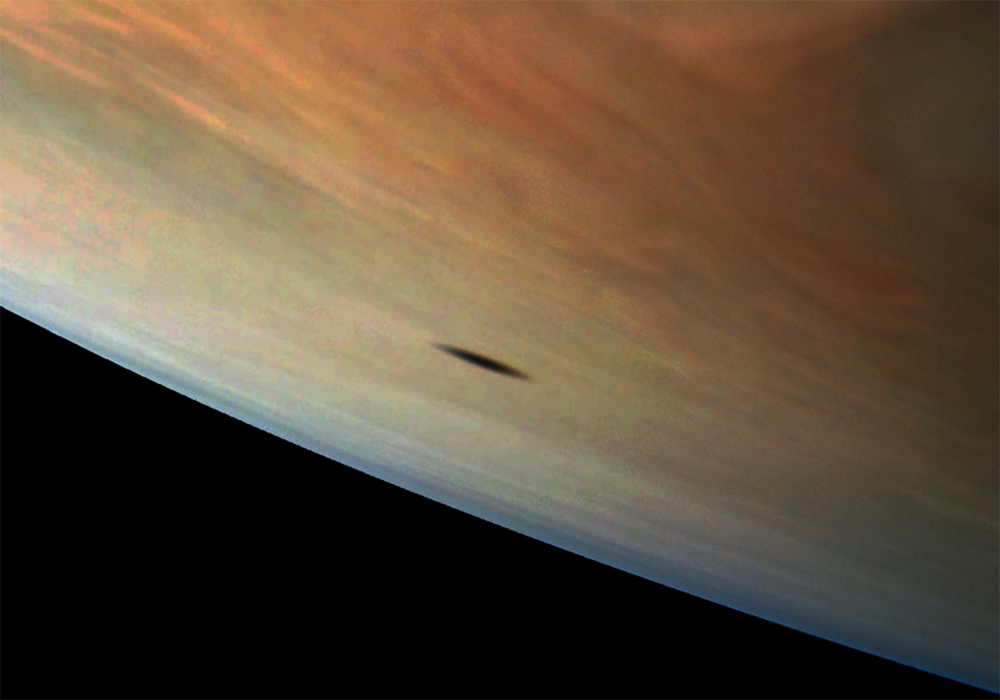
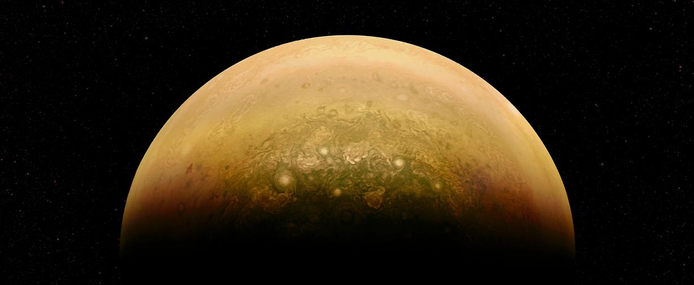

# Тень Амальтеи на поверхности Юпитера

Еще совсем недавно подобное изображение могло быть создано только с использованием компьютерной графики. Но благодаря современным космическим аппаратам мы можем побывать на орбитах планет Солнечной системы и увидеть их поверхность с расстояния в несколько тысяч километров.

На данном снимке мы видим тень от Амальтеи — спутника Юпитера, вращающегося вокруг газового гиганта на скорости 26,5 км/с. Амальтея полностью состоит из льда и имеет неправильную форму 250×146×128 км.

Уникальная фотография сделана космическим аппаратом Юнона. 9 октября 2013 года Юнона совершила гравитационный маневр у Земли и устремилась к Юпитеру на скорости 40 000 км/ч. За 2 года и 8 месяцев полета космический аппарат преодолел 2,8 млрд. км, после чего вышел на орбиту самой крупной планеты Солнечной системы.

Основная задача Юноны — изучение гравитационного и магнитного полей Юпитера, а также атмосферы гигантской газовой планеты.

Рекомендуем
Самое детализированное фото Плутона. Более качественного нынешнее поколение людей не увидит