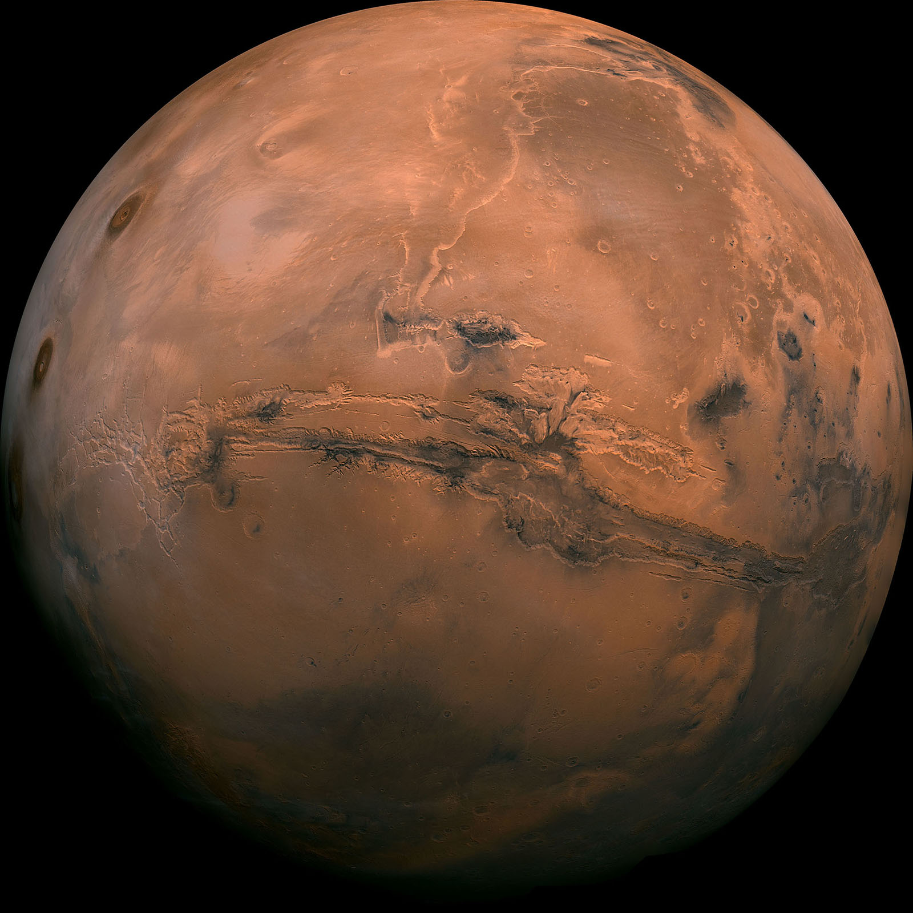
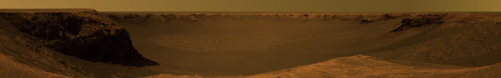
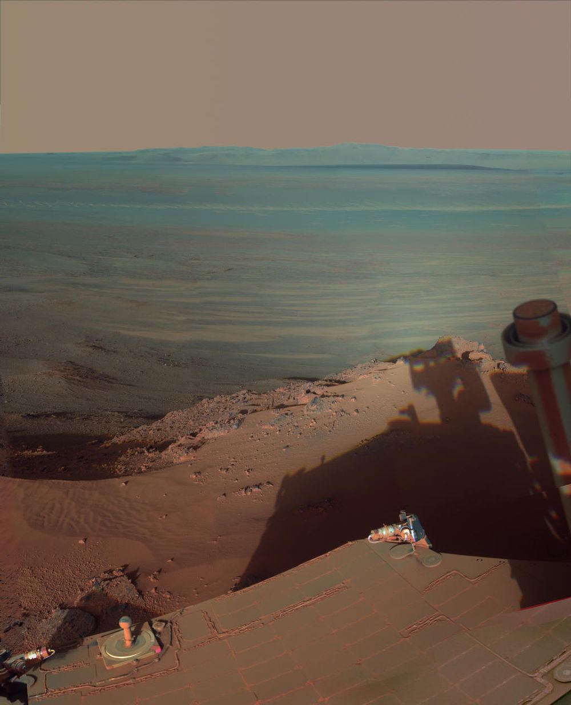
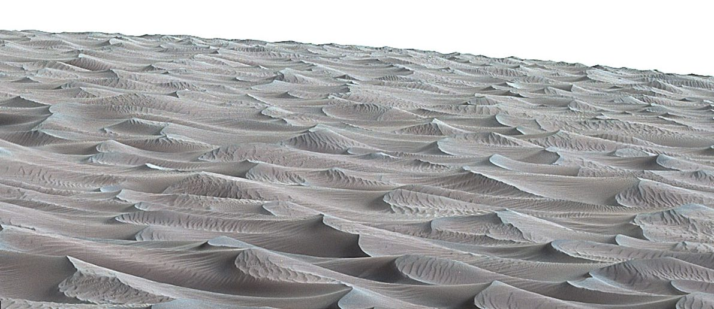
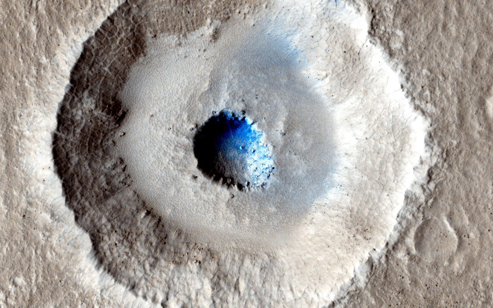
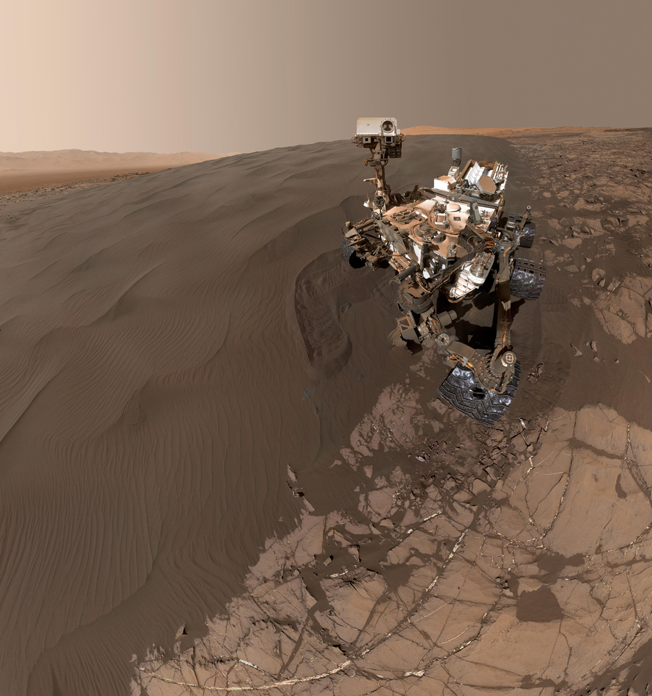
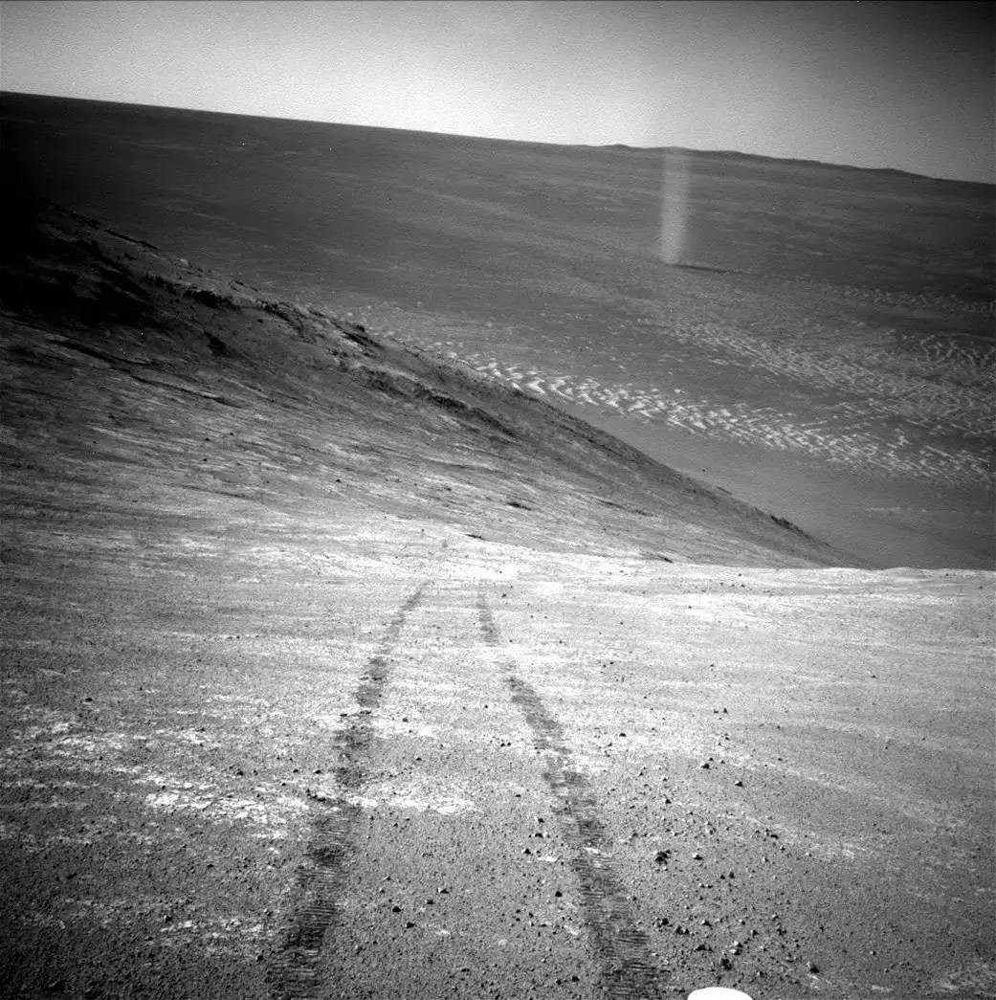
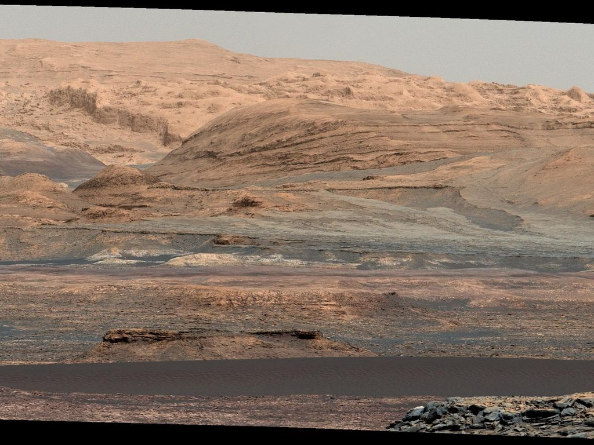

# Лучшие фотографии Марса на сегодняшний день

Пока человек только готовится высадиться на Марсе, на поверхности Красной планеты вовсю работают автоматические станции, а по ее орбите летают искусственные спутники, составляя подробную карту поверхности четвертой от Солнца планеты. Представляем подборку из 10 лучших снимков Марса и его поверхности, которые делают далекую планету чуть ближе.

Фотография поверхности Марса вместе с долиной Маринер — гигантской системой каньонов, которые образовались еще в процессе формирования планеты. Чтобы получить одно цельное изображение, ученым пришлось сложить воедино более 100 отдельных изображений, переданных на Землю космическим аппаратом «Викинг-2».

Ударный кратер Виктория диаметром около 800 метров был сфотографирован марсоходом «Opportunity» 16 октября 2006 года. Переслать столь качественное изображение на Землю — задача не из простых. На получение всех составляющих частей данного снимка ушло целых три недели.

Самый большой ударный кратер Марса диаметром 22 километра носит название «Индевор». Он был сфотографирован все тем же неутомимым «Opportunity» 9 марта 2012 года.

Цвет этих марсианских песчаных дюн напоминает волны на поверхности земного моря. Формируются песчаные дюны на Марсе точно так же как и на Земле — под воздействием ветра, перемещаясь в год на несколько метров. Снимок был сделан марсоходом «Curiosity» 27 ноября 2015 года. 

Этот снимок небольшого ударного кратера, сделанный орбитальной станцией Mars Reconnaissance Orbiter, показывает, как много льда может скрываться под поверхностью Марса. Упавший на поверхность планеты метеорит смог пробить поверхностный слой и обнажить большое количество замерзшей воды. Возможно, миллиарды лет назад на поверхности Марса действительно располагались моря и океаны.

Знаменитое «cелфи» марсохода «Curiosity», сделанное 19 января 2016 года неподалеку от ударного кратера Гейл.

Именно так выглядит закат на Марсе. Снимок сделан аппаратом «Спирит» 19 мая 2005 года. Голубоватый оттенок неба во время заката или восхода на Марсе возникает по тем же причинам, почему мы видим голубое небо на Земле. Световые волны определенной длины, соответствующие синему и голубому свету, рассеиваются, сталкиваясь с молекулами газа и пыли, поэтому мы воспринимаем небо именно голубого цвета. Вот только на Марсе, где атмосфера намного менее плотная, такой эффект можно заметить, когда свет проходит через максимальную толщу воздуха — то есть на рассвете или на закате.

Следы колес аппарата «Оппортьюнити» и пыльный вихрь на заднем фоне. И хотя пыльные вихри — довольно частое явление для Марса, поймать один из них в кадр — настоящая удача.

Кажется, будто эта фотография сделана не за 225 миллионов километров от Земли аппаратом «Curiosity», а где-нибудь в пустынной местности на нашей планете.