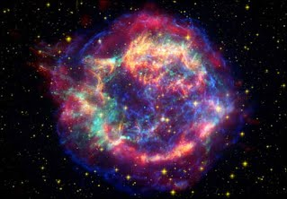

# Впечатляющая гибель звезды в отдаленном созвездии!

Созвездие «Тухлое яйцо», расположенное на расстоянии 4.2 тысячи световых лет от Земли, примечательно не только своим странным названием, но и наличием умирающей звезды под кодовым именем OH 231.8+04.2. Тест на редактирование статьи, входящей в выпуск

Впечатляющие кадры, сделанные телескопом Хаббл, показывают звезду солнечного типа на последнем этапе своей жизни. В среднем звезды, подобные Солнцу, живут около 10 млрд. лет, пока в их ядре не закончится водород, запустив реакции горения гелия, что вызовет чудовищный рост внешней оболочки. Например, в конце своего жизненного цикла внешние слои Солнца будут расположены на текущей орбите Земли.

На снимке мы видим последствия потери OH 231.8+04.2 звездного вещества и начало формирования планетарной туманности. Ученым редко удаётся зафиксировать подобные моменты эволюции звёзд, так как по астрономическим меркам они длятся мгновения. Приблизительно через 1000 лет планетарная туманность будет окончательно сформирована, а сама звезда превратится в белого карлика размером меньше Земли и, лишенная внутреннего топлива, будет миллиарды лет остывать в космическом пространстве.

Подобная судьба ждёт и наше Солнце, что обернётся настоящей катастрофой для всей Солнечной системы.

