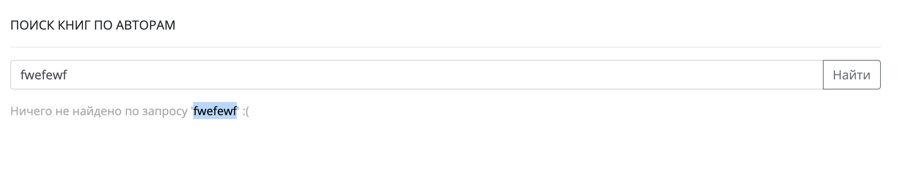

# Что такое XSS-уязвимость и как тестировщику не пропустить ее!


По моему наблюдению довольно много тестировщиков когда-либо слышали такое понятие, как XSS-уязвимость. Но мало кто может просто и на пальцах рассказать на собеседовании про нее. Или эффективно проверить веб-сайт на наличие этой уязвимости. Давайте вместе разберемся со всем этим подробнее и попробуем сами найти несложную XSS-уязвимость на демо-странице, которую я специально подготовил к этой статье.

Если вы гуру тестирования безопасности и на раз-два участвуете в баунти-программах крупных IT-компаний, а количество найденных вами XSS исчисляется десятками или даже сотнями — можно смело проходить мимо этой статьи. Если же вы новичок в теме и только начинаете интересоваться поиском уязвимостей — добро пожаловать под кат.

Определение

XSS (англ. Cross-Site Scripting — «межсайтовый скриптинг») — довольно распространенная уязвимость, которую можно обнаружить на множестве веб-приложений. Ее суть довольно проста, злоумышленнику удается внедрить на страницу JavaScript-код, который не был предусмотрен разработчиками. Этот код будет выполняться каждый раз, когда жертвы (обычные пользователи) будут заходить на страницу приложения, куда этот код был добавлен. А дальше существует несколько сценариев развития.

Первый: злоумышленнику удастся заполучить авторизационные данные пользователя и войти в его аккаунт.

Второй: злоумышленник может незаметно для жертвы перенаправить его на другую страницу-клон. Эта страница может выглядеть совершенно идентично той, на которой пользователь рассчитывал оказаться. Но вот принадлежать она будет злоумышленнику. Если пользователь не заметит подмены и на этой странице введет какие-то sensitive data, то есть личные данные, они окажутся у злоумышленника.

Третий… да в общем-то много чего еще можно придумать. Почти все, что может JavaScript, становится доступным для злоумышленника. Чуть ниже мы рассмотрим подробнее один из таких примеров. А пока давайте попробуем чуть подробнее обсудить, как именно устроена уязвимость. И почему злоумышленнику удается внедрить свой код в чужое приложение без доступа к его исходникам.

Небольшое предупреждение. Вся информация далее представлена исключительно в информационных целях. Тестировщик должен уметь проверять свое веб-приложение на уязвимости. Однако, использование XSS-уязвимостей на чужих ресурсах является незаконным.

Если говорить про действующее российское законодательство, когда исследователь тестирует чужой продукт на предмет уязвимостей или проникает в чужую сеть без ведома и согласия владельца, его действия могут быть расценены как неправомерные.

Но вернемся к XSS.

Как устроена уязвимость?

Прежде всего, как именно удается внедрить на страницу JavaScript-код, которого там раньше не было? И как получается распространить этот код среди других пользователей?

Например, можно добавить JavaScript-код в поле ввода, текст из которого сохраняется и в дальнейшем отображается на странице для всех пользователей. Это может быть поле для ввода информации о себе на странице профиля социальной сети или комментарии на форуме.

Злоумышленник вводит текст (и за одно вредоносный код), который сохраняется на странице. Когда другие пользователи зайдут на эту же страницу, вместе с текстом они загрузят и JavaScript-код злоумышленника. Именно в момент загрузки этот код отработает. Конечно, уязвимость сработает, только если текст при сохранении не будет обезопасен. О том, как это сделать, и почему разработчики иногда забывают об этом, поговорим чуть позже.

Это лишь самый простой и очевидный пример того, где может быть спрятана уязвимость. Более интересный пример мы с вами чуть ниже рассмотрим на специально подготовленной демо-страничке.

А пока давайте двигаться дальше.

Почему такие ошибки часто встречаются на веб-проектах?

Суть в том, что браузер не может самостоятельно отличить обычный текст от текста, который является CSS, HTML или JavaScript-кодом. Он будет пытаться обрабатывать все, что находится между тегами ```<script>```, как JavaScript-код. Все, что находится между тегами ```<style>```, считать CSS. И все, что похоже на тег, считать HTML-кодом.

Если разработчик хочет, чтобы какой-то текст только выглядел как код, но таковым не являлся (то есть не обрабатывался браузером, а выводился как есть), этот текст надо специально обработать прежде, чем отдать его браузеру. Такая обработка называется “экранированием”.

В процессе экранирования текста в этом тексте все спец. символы заменяются их “аналогами”, и браузер уже знает наверняка, что это просто текст. Важнее всего обрабатывать тот текст, который приходит от пользователя, так как любой пользователь может оказаться злоумышленником и вместе с текстом прислать какой-нибудь код. Увы, иногда разработчики забывают об экранировании в тех или иных местах веб-приложения, и текст выводится без всякой обработки. Причин для этого может быть несколько.

Например, не всегда программист держит в уме все места, где текст, заданный пользователем, попадает на страницу. Более того, иногда разные части сайта могут создаваться в разное время и/или разными людьми. В этом случае вероятность ошибки возрастает.

Еще причина может быть в том, что уязвимость находится не в коде самого разработчика, а в коде библиотеки, которую он использует. Обычно это какие-то готовые фреймворки для создания веб-сервисов. В таком случае разработчик, конечно, может даже не подозревать то, что подключая к проекту этот фреймворк, он автоматически подключает к нему же уже готовую уязвимость.

Такой риск есть всегда. Все же писать приложение полностью с нуля, не используя вообще никаких библиотек, в наше время долго и дорого. Далеко не каждая компания может позволить себе разработку такого уровня.

В этом случае вся надежда на тестировщиков.

Чем опасна XSS-уязвимость?

Давайте еще раз, более детально, поговорим об опасности XSS-уязвимости. Сама по себе уязвимость не является опасной. Опасной она становится тогда, когда ее находит злоумышленник и начинает ее использовать в своих целях. Использование уязвимости называется “вектором атаки”. В случае XSS векторов атаки довольно много.

Самый простой пример — кража авторизационных cookie пользователей веб-приложения. Чаще всего сайт, на котором присутствует авторизация, отличает авторизованного пользователя по так называемой сессионной cookie. Если ее нет, то пользователь не авторизован. А если она есть, то по значению этой cookie сервер может отличить одного пользователя от другого.

Все cookie хранятся на компьютере пользователей. Если я авторизуюсь своим пользователем, я буду видеть свое значение cookie. А значение чужой просто так узнать не смогу.

То же касается JavaScript-кода, который выполняется в браузере пользователя. Этот JavaScript-код будет видеть значение cookie того пользователя, в браузере которого он исполняется и только его.

Теперь допустим, что злоумышленнику удастся внедрить JavaScript-код на страницу веб-приложения. У любого пользователя, который теперь зайдет на эту страницу, будет исполняться в браузере JavaScript-код. Он будет читать значение cookie этого пользователя (теперь уже жертвы). Осталось только передать это значение злоумышленнику — и дело сделано. Но как передать значение, ведь вредоносный код исполняется в браузере жертвы?

Все довольно просто. Этот же JavaScript-код может создать AJAX-запрос на удаленный сервер. Например, на вот такой URL: www.zloy-site.ru/stolen={значение_cookie_жертвы}

Домен zloy-site принадлежит злоумышленнику из нашего примера. Все запросы, которые приходят на этот домен, записываются в базу данных. Посмотрев на параметры URL, злоумышленник узнает значения cookie жертв и сможет их использовать, чтобы попасть в их аккаунты.

Как мы обсудили выше — это не единственное, чем опасна XSS-уязвимость. Так что ради безопасности и для защиты своих пользователей необходимо уметь искать и закрывать подобные уязвимости на ваших проектах.

Где искать XSS? Как с ней бороться? Демо-страница с примером

В первую очередь стоит проверять на XSS-уязвимости те места на сайте, в которых у обычного пользователя есть возможность повлиять на контент. Если он может добавить в какое-то место определенный текст, он сможет попытаться добавить и JavaScript-код.

Давайте это рассмотрим на конкретном примере. Я подготовил очень простую песочницу, где спряталась XSS-уязвимость. Предлагаю попробовать ее найти вместе.

Открываем песочницу: https://playground.learnqa.ru/demo/xss

Для начала посмотрим, как устроена страница. Это по сути очень простой каталог книг, в котором есть поиск. Если ввести в запросе “Рей Брэдбери” мы увидим все книги, которые есть в этом каталоге этого автора.


Внимательный пользователь уже заметил, что текст, который мы вводили в поле поиска, тут же оказался в URL. Нам этот момент еще пригодится.

А пока давайте попробуем вставить какую-нибудь ерунду в поле поиска: “fwefewf”.

Мы увидим, что в этом случае ничего найти на странице не удалось. А текст запроса повторился в тексте ошибки:



Итак, мы с вами обнаружили место, где появляется текст, вводимый нами. Следовательно, это и есть потенциальное место для XSS-уязвимости. Давайте попробуем вставить самый популярный JavaScript-код для проверки, есть ли там уязвимость.

```<script>alert(123)</script>```

В случае, если страница является уязвимой, после ввода этого кода на странице появится вот такое окошко:


Форма не позволяет нам осуществить поиск по такому значению, так как форма валидируется и хочет работать только с буквами и цифрами. На первый взгляд кажется, что разработчик все учел и защитил страницу от XSS, но это не совсем так.

Помните, чуть выше мы с вами заметили, что текст, который мы вводим в поле поиска, отображается в URL в так называемом GET-параметре? Имя этого параметра “q”, а значение — то, что мы вводим в поле поиска. Это сделано для того, чтобы можно было скопировать URL вместе с этой самой строкой поиска и в следующий раз открыть страницу сразу с нужными авторами.

Например, вот такой URL откроет страницу сразу только с книгами Рея Брэдбери: playground.learnqa.ru/demo/xss?q=Рей+Брэдбери

В отличие от формы, валидацию URL разработчик сделать не мог — любой пользователь в своем браузере может ввести любой URL, какой захочет, в том числе и с любым значением GET-параметра. Задача разработчика в этом случае — не забыть учесть все варианты и написать правильный обработчик значения этого GET-параметра.

Проверим, не забыл ли наш разработчик все учесть тут. Попробуем в GET-параметр “q” подставить тот самый JavaScript-код: https://playground.learnqa.ru/demo/xss?q=<script>alert(123)</script>

Перейдя по этому URL мы видим, что на странице появилось окошко со значением 123. Но почему?

Все довольно просто. Помните, когда сайт не может найти нужные книги по заданному поисковому запросу, он текст этого поискового запроса выводит в тексте ошибке? Мол, не нашли ничего по запросу “бла-бла”. Вот вместо этого “бла-бла” у нас теперь JavaScript-код с алертом. Разработчик написал валидацию поля ввода и решил, что так он защитил сайт от того, чтобы JavaScript мог оказаться в поисковом запросе. И не стал экранировать текст ошибки. Нам же удалось обойти валидацию через URL, поменяв там значение поискового запроса.

Ради интереса теперь можем вывести значение нашей сессионной cookie, для этого вместо ```<script>alert()</script> в URL надо подставить другой код: <script>alert(document.cookie)</script>```

С этим я уже предоставлю поиграться вам самостоятельно. :)

Найдя ошибку, стоит обратиться к разработчикам — они ее исправят.

Способов закрыть ошибку довольно много. Экранировать текст — не единственный из них. Еще можно запретить самому JavaScript видеть некоторые cookie. Для этого у cookie есть специальный параметр “http only”. Если он выставлен в TRUE, JavaScript никак не сможет узнать, что такая cookie вообще выставлена и не сможет ее прочитать и передать злоумышленнику даже в том случае, если ему удастся найти XSS на вашем проекте.

Все это — лишь малый, далеко не полный список манипуляций, предотвращающий XSS-уязвимости. Как писалось выше — при обнаружении XSS в ходе тестирования лучше всего пообщаться с программистами.

Если Вам интересно знать больше про тестирование безопасности, хочется лучше разобраться в устройстве клиент-серверной архитектуры, понять и отточить самые эффективные способы поиска уязвимостей на настоящем веб-приложении, приходите на мой курс “Тестирование безопасности”. Вся необходима информация есть в моем профиле.

Вас ждет только полезная и нужная теория без воды и большое количество практических примеров и заданий. Вы будете исследовать множество веб-страниц, напичканных самыми разными уязвимостями. Итоговой работой станет большое исследование либо вашего рабочего проекта, либо одного из веб-приложений таких гигантов как Google, Facebook, Twitter и так далее.