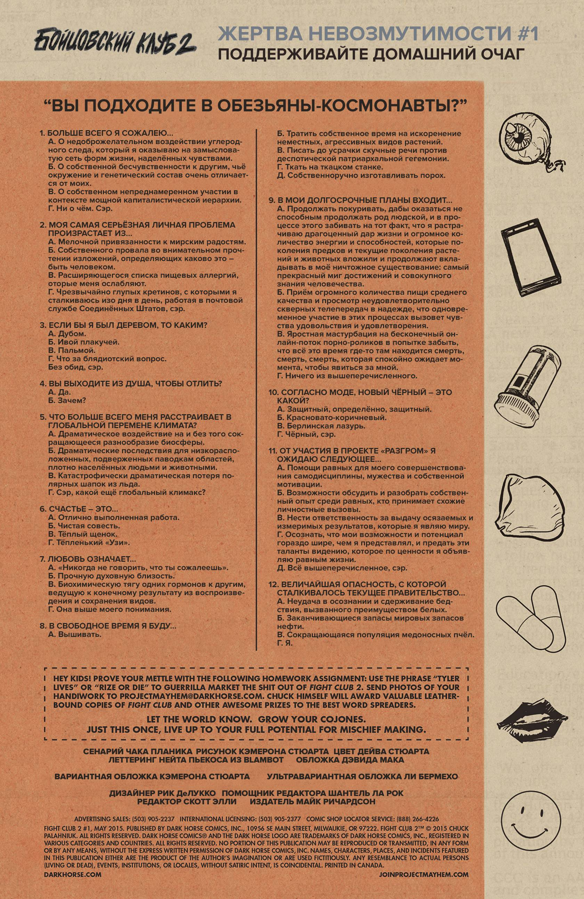
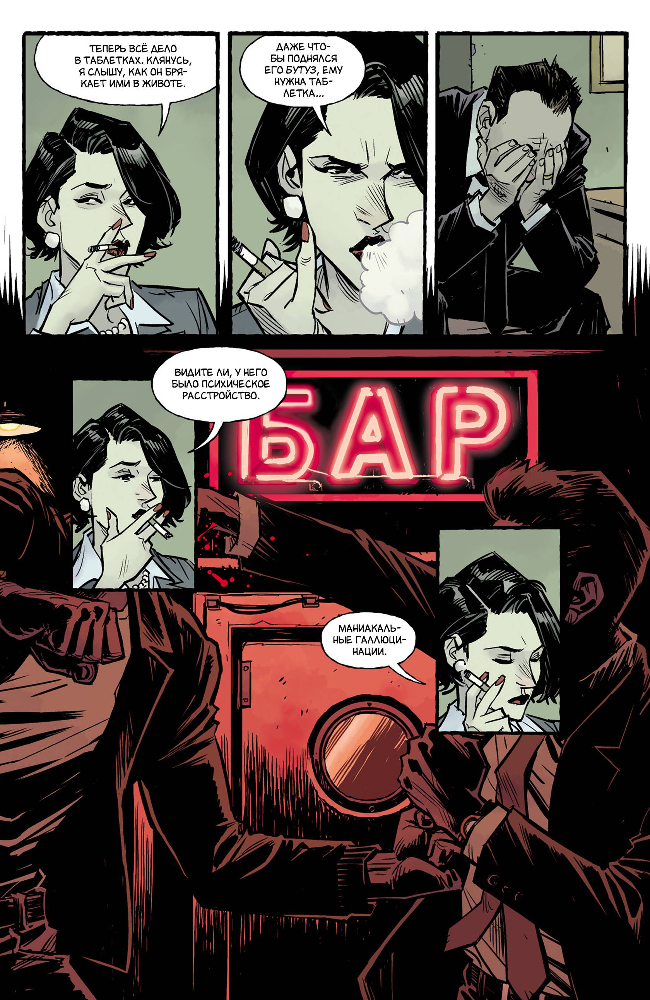
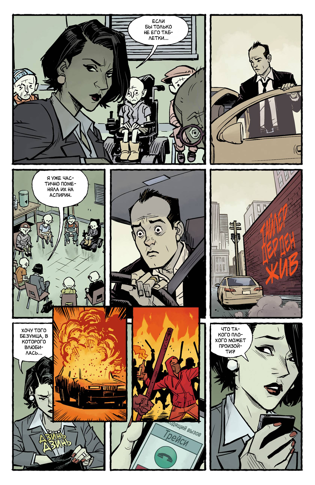
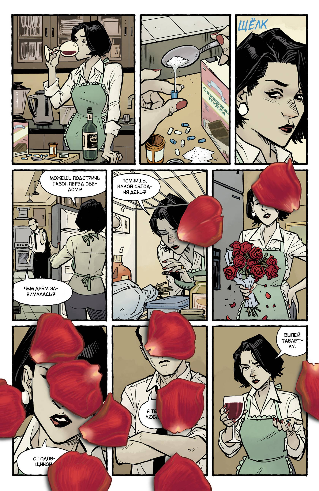
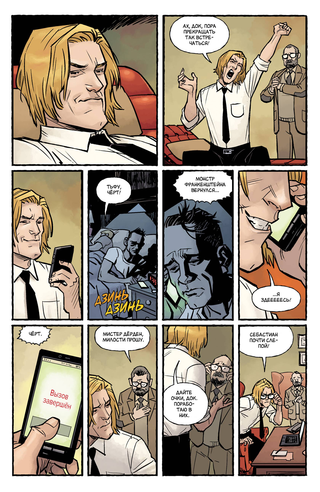
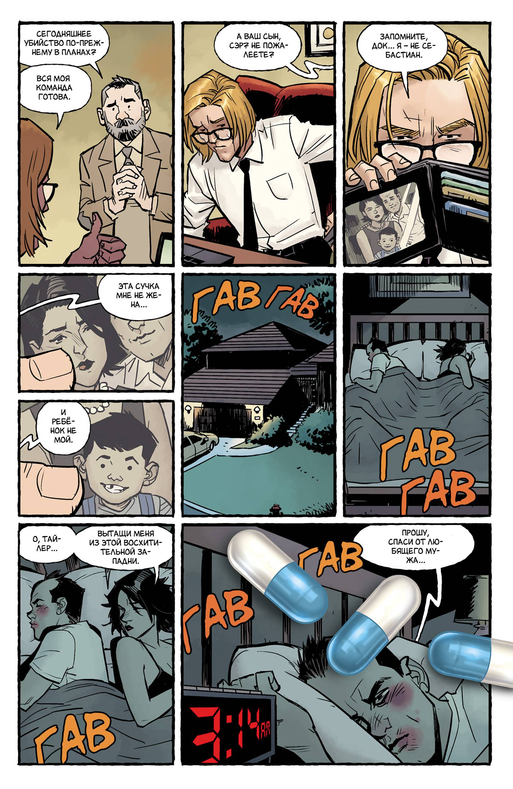
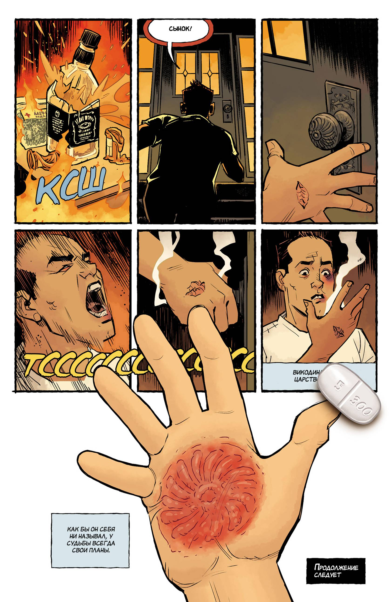
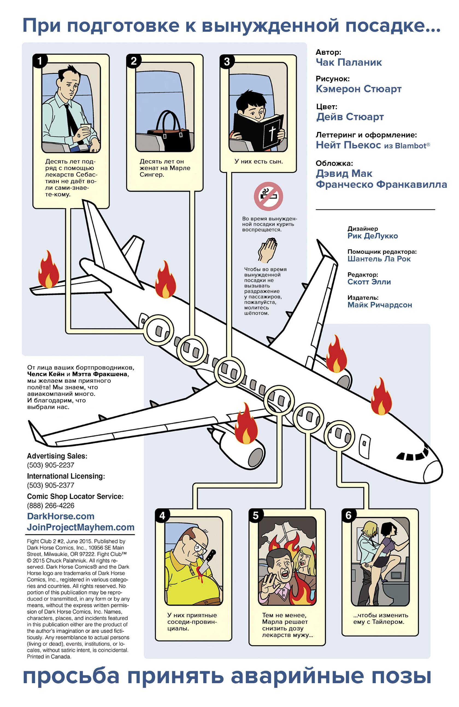

# Графический роман (англ. graphic novel), англиц. графическая новелла — один из форматов комиксов. Представляет собой объёмный роман, в котором сюжет передаётся через рисунок, а текст 

Графический роман "Бойцовский Клуб 2" (книги 1-2)

