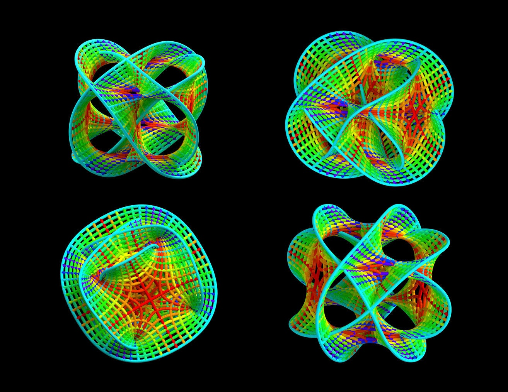

# ТЕОРИЯ СТРУН И ОБЪЕДИНЕНИЕ ФУНДАМЕНТАЛЬНЫХ ВЗАИМОДЕЙСТВИЙ

В течение уже более пятнадцати лет развитие теоретической физики высоких энергий проходит под знаком суперструнной революции, открывшей замечательные возможности построения объединенной теории фундаментальных взаимодействий и элементарных частиц. Впечатляющие успехи теории суперструн позволили ученым, работающим в этой области, ввести совершенно серьезно, без тени юмора название “теория всего” или TOE (theory of everything), как это впервые было написано по-английски.

Согласно теории суперструн, первичными структурными элементами природы являются не точечные
элементарные частицы, как было принято считать, а
элементарные одномерные протяженные объекты, называемые струнами. Характерная длина элементарной
струны чрезвычайно мала, ее размер порядка планковской длины LPl = ("G/c3)
1/2 ≈ 1,6 ⋅ 10−33 см, где " – постоянная Планка, c – скорость света, G – гравитационная
постоянная. По этой причине элементарные струны не могут быть непосредственно заметны на расстояниях много
больших планковской длины, которые собственно и доступны в современных экспериментах. Грубо говоря,
когда мы смотрим на маленький отрезок издалека, он представляется точкой. Однако с уменьшением пространственно-временных масштабов протяженный характер элементарных объектов начинает существенно
проявлять себя и, как вытекает из теории струн, открывается совершенно новый,неожиданный путь к объединенной теории всего.

В процессе развития теория суперструн впитала многие фундаментальные достижения теоретической
физики XX века, а также некоторые теоретические построения, которые до этого выглядели достаточно искусственно. Примером может служить старая теория Калуца–Клейна–Фока, основанная на представлении
о многомерном физическом пространстве–времени и по существу вошедшая как элемент в теорию суперструн.
К настоящему времени теория суперструн достигла уровня, аналогичного уровню квантовой теории поля
во второй половине 60-х годов XX века, когда общая картина слабо взаимодействующих элементарных частиц была достаточно хорошо развита. Сейчас можно сказать, что в целом наше качественное представление
о слабо взаимодействующих струнах выглядит вполне ясным, хотя, конечно, разработка вопросов, деталей,
частных случаев, нахождение более адекватных математических методов будут еще долго продолжаться.
При этом наблюдается явный прогресс в решении проблем, которые в рамках всех предшествующих подходов представляли собой непреодолимые барьеры. Современный этап суперструнной революции связан с
построением теории сильно взаимодействующих струн и изучением структуры струнного вакуума. Здесь достигнуты очень интересные результаты и начинает вырисовываться совершенно новая физика, однако подводить итоги этому этапу теории еще слишком рано.
